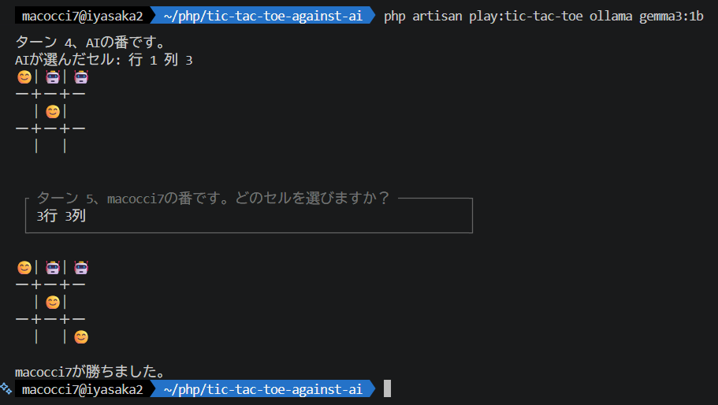

# AI対戦３並べ (Powered by Laravel AI SDK)

AI対戦３並べのCLI版です。

Laravel(13) AI SDKで作りました。



## 前提
- 対応言語：日本語
- PHP8.3CLI以降インストール済（Laravel13要件）
- [Composer v2](https://getcomposer.org/)インストール済
- Laravel AI SDK[(Text)サポート対象のAIサービス](https://laravel.com/framework/docs/13.x/ai-sdk#provider-support)が利用可能

## 使い方

このリポジトリを何らかの手段でローカルにコピーしてください。

```bash
git clone https://github.com/macocci7/tic-tac-toe-against-ai.git
```

次のコマンドで依存関係をインストールしてください。

```bash
composer install
php artisan vendor:publish --provider="Laravel\Ai\AiServiceProvider"
```

OpenAI等の有料サービスを使う場合は`.env`に[APIキーを設定](https://laravel.com/framework/docs/13.x/ai-sdk#configuration)してください。

```
OPENAI_API_KEY=sk-proj-********************************
```

Ollamaをローカルで使用する場合は設定不要です。

CLI上でコマンドで実行します。

▼コマンドの書式
```
php artisan play:tic-tac-toe [プロバイダー名] [モデル名]
```

▼コマンド例
```
php artisan play:tic-tac-toe
php artisan play:tic-tac-toe openai
php artisan play:tic-tac-toe ollama gemma3:1b
```
プロバイダー名とモデル名を省略した場合、`.env`内のAPIキーが設定されているプロバイダーが選択されます。

プロバイダー名のみでモデル名を省略した場合、一番安いモデルが選択されます。

ollamaの場合はモデル名を指定しないとエラーになります。

該当するプロバイダー、該当するモデルが無い場合はエラーになります。

## LICENSE

[MIT](LICENSE)
