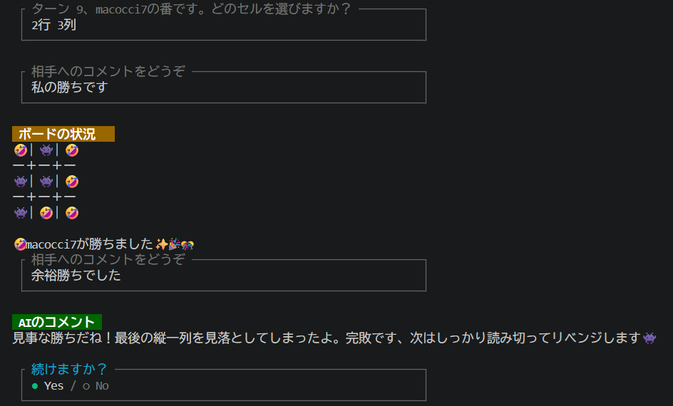

# AI対戦３並べ (Powered by Laravel AI SDK)

AI対戦３並べのCLI版です。

Laravel(13) AI SDKで作ったデモプロジェクトです。

人間プレイヤー対AIモード、AI対AIモードがあります。



## 前提
- 対応言語：日本語
- [Git](https://git-scm.com/book/ja/v2/%E4%BD%BF%E3%81%84%E5%A7%8B%E3%82%81%E3%82%8B-Git%E3%81%AE%E3%82%A4%E3%83%B3%E3%82%B9%E3%83%88%E3%83%BC%E3%83%AB)インストール済（なくても遊べます。あればコピーと更新が楽。）
- PHP8.3CLI以降インストール済（Laravel13要件）
- [Composer v2](https://getcomposer.org/)インストール済
- Laravel AI SDK[(Text Feature)サポート対象のAIサービス](https://laravel.com/framework/docs/13.x/ai-sdk#provider-support)が利用可能

## 使い方

このリポジトリを何らかの手段でローカルにコピーしてください。

▼Gitが使える場合
```bash
git clone https://github.com/macocci7/tic-tac-toe-against-ai.git
```

▼Gitが使えない場合
- https://github.com/macocci7/tic-tac-toe-against-ai を開く。
- 画面上部緑色の「Code」ボタンから「Download ZIP」を選択。
- ダウンロードしたZIPを展開。

ローカルにコピーしたリポジトリのフォルダに入ります。

```bash
cd tic-tac-toe-against-ai
```

次のコマンドで依存関係をインストールしてください。

```bash
composer install
php artisan vendor:publish --provider="Laravel\Ai\AiServiceProvider"
```

OpenAI等の有料サービスを使う場合は`.env`に[APIキーを設定](https://laravel.com/framework/docs/13.x/ai-sdk#configuration)してください。

```
OPENAI_API_KEY=sk-proj-********************************
```

Ollamaをローカルで使用する場合は設定不要です。

CLI上でコマンドで実行します。

▼コマンド書式
```
Usage:
  play:tic-tac-toe [options] [--] [<provider> [<model>]]

Arguments:
  provider                     AIプロバイダー (例 openai, ollama)
  model                        AIモデル名 (例 gpt-6-luna, gemma3:1b)

Options:
      --no-conversation        対話を無効にする
      --ai-vs-ai               AI同士で対戦させる
      --provider1[=PROVIDER1]  (AI同士対戦) AIプロバイダー1 (例 openai, ollama)
      --model1[=MODEL1]        (AI同士対戦) AIモデル名1 (例 gpt-6-luna, gemma3:1b)
      --provider2[=PROVIDER2]  (AI同士対戦) AIプロバイダー2 (例 openai, ollama)
      --model2[=MODEL2]        (AI同士対戦) AIモデル名2 (例 gpt-6-luna, gemma3:1b)
```

- `provider`/`model` は人間プレイヤー対AIモード専用です。
- `provider1`/`model1`, `provider2`/`model2` はAI対AIモード専用です。

▼コマンド例
```
php artisan play:tic-tac-toe
php artisan play:tic-tac-toe openai
php artisan play:tic-tac-toe ollama gemma3:1b
php artisan play:tic-tac-toe --no-conversation
php artisan play:tic-tac-toe --ai-vs-ai
php artisan play:tic-tac-toe --ai-vs-ai \
    --provider1=ollama --model1=gemma3:1b \
    --provider2=ollama --model2=llama3.2:3b
```
プロバイダー名とモデル名を省略した場合、[config/ai.php](config/ai.php)で設定されている`default`プロバイダーが選択されます。

プロバイダー名のみでモデル名を省略した場合、一番安いモデルが選択されます。

ollamaの場合はモデル名を指定しないとエラーになります。

該当するプロバイダー、該当するモデルが無い場合はエラーになります。

`--no-conversation` オプションを付けることでチャットをオフにできます。

`--ai-vs-ai` オプションを付けることでAI対AIモードにできます。

AI対AIモードの場合、`provider`と`model`は無視され `provider1`, `model1`, `provider2`, `model2` が適用されます。

AI対AIモードで `provider1`, `model1`, `provider2`, `model2` のいずれかが省略された場合、

補完入力が表示され、それぞれ指定できるようになっています。

## LICENSE

[MIT](LICENSE)
